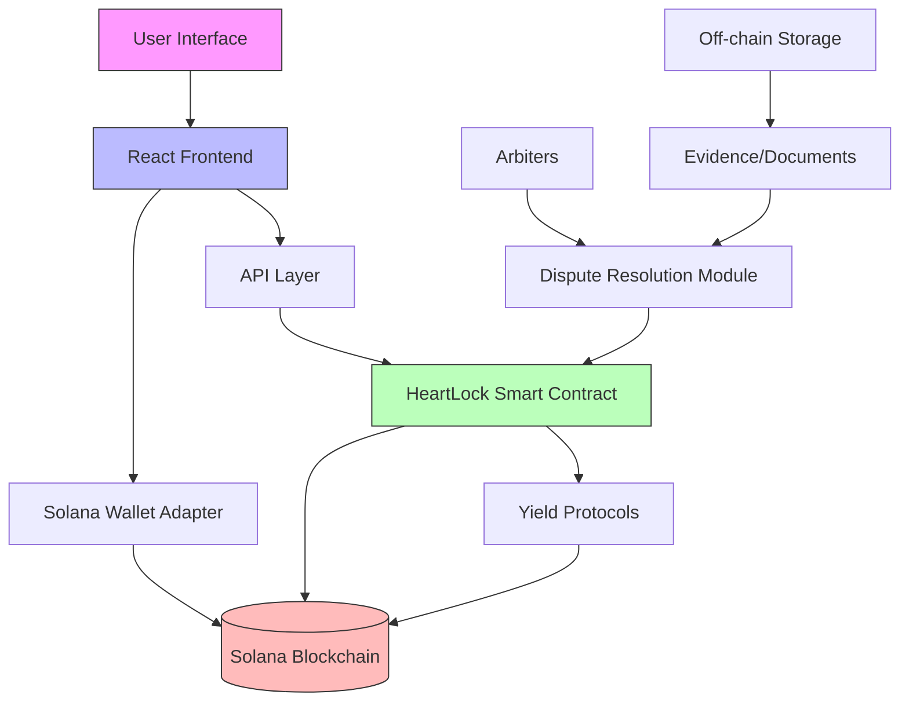
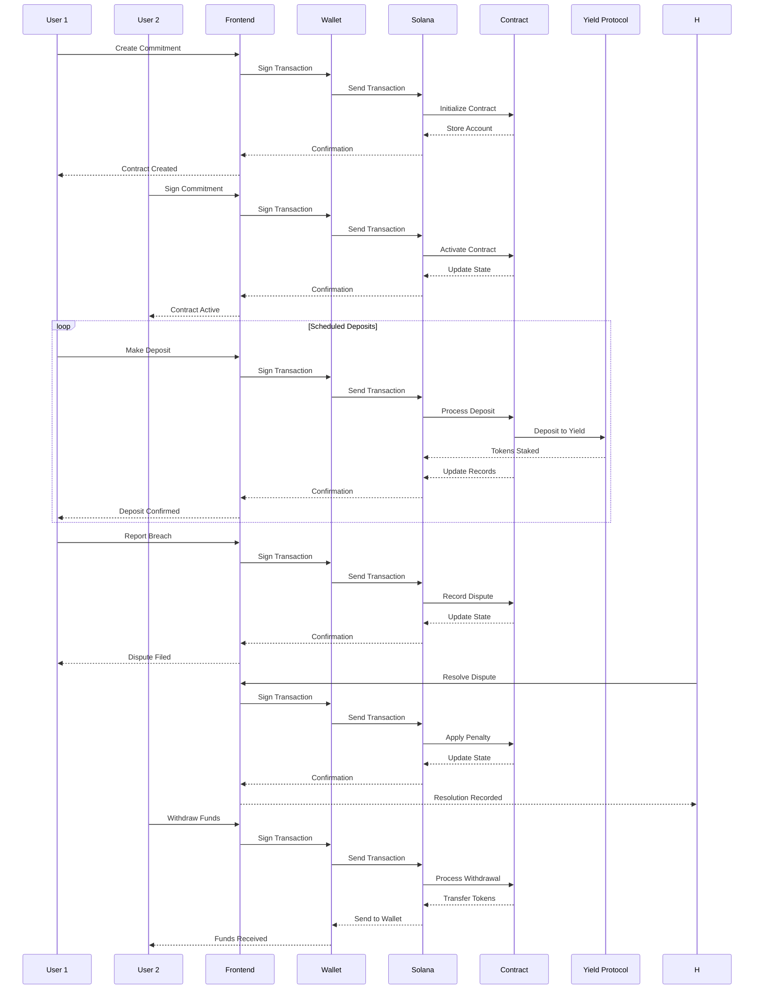

# HeartLock System Architecture

## Component Diagram



## Data Flow Diagram



## Smart Contract State Machine

```mermaid
stateDiagram-v2
    [*] --> Initialized: Create Contract
    Initialized --> Active: Both Sign
    Active --> Active: Deposits Made
    Active --> Completed: Term Ends
    Active --> Disputed: Breach Reported
    Disputed --> BreachValidated: Arbiter Confirms
    Disputed --> Active: Arbiter Rejects
    BreachValidated --> [*]: Penalty Applied
    Completed --> [*]: Successful Withdrawal